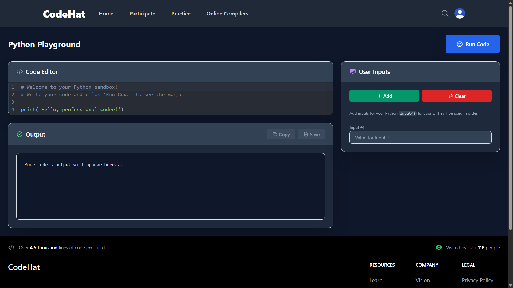

# CodeHat

[](https://opensource.org/licenses/MIT)
[](./CONTRIBUTING.md)
[](https://github.com/the-adee/CodeHat/issues)
[](https://github.com/the-adee/CodeHat/fork)
[](https://github.com/the-adee/CodeHat/stargazers)

> The way you code shapes the way you think. And the platform you choose shapes the coder you become.

CodeHat is a platform designed to provide a seamless and efficient coding environment in your browser. Run code with custom inputs, test algorithms, and experiment with logic without the overhead of a traditional IDE.

This repository contains the official **open-source frontend** for the CodeHat platform.

**Built for Coders, Open to Everyone. No Cost. No Catch. Just Code.**


_This is how CodeHat code editor looks._

---

## ✨ Key Features

- **High-Performance Editor**: A lightweight and optimized code editor built with CodeMirror, designed to be faster and more responsive than many conventional online editors.
- **Custom Input Handling**: Easily provide standard input (`stdin`) to your programs to test various edge cases and scenarios.
- **Initial Language Support**: Currently optimized for Python, with a clear roadmap to include more languages.
- **Open Source Frontend**: The entire user-facing interface is open source (MIT License), welcoming community contributions and ensuring transparency in its development.

## 🚀 Getting Started

To get the CodeHat frontend running on your local machine for development or contributions, follow these steps:

1.  **Clone the repository:**

    ```sh
    git clone https://github.com/YOUR_GITHUB_USERNAME/YOUR_REPOSITORY_NAME.git
    cd YOUR_REPOSITORY_NAME
    ```

2.  **Install dependencies:**

    ```sh
    npm install
    ```

3.  **Run the development server:**
    ```sh
    npm start
    ```
    The application will be available at `http://localhost:3000`.

## 🛠️ Technology Stack

- **Frontend:** React.js
- **Code Editor:** CodeMirror
- **Styling:** Tailwind CSS

## 🗺️ Roadmap

We are actively working to evolve CodeHat into a full-fledged platform. Our current focus is on building a robust and secure multi-language backend.

- [ ] **Containerized Backend**: Implementing Docker to create isolated and secure execution environments for user code.
- [ ] **Multi-Language Support**: Expanding beyond Python to include JavaScript, C++, Java, and Go.
- [ ] **User Accounts**: Allowing users to save their code snippets and history.
- [ ] **UI/UX Enhancements**: Continuously improving the user interface.
- [ ] **Backend Source**: Considering open-sourcing the backend in the future.

## 🤝 How to Contribute

Contributions to the CodeHat frontend are highly welcome! Whether it's a bug fix, a new feature, or a documentation update, your input is valued.

- **Report a Bug:** Find a bug? Please [open an issue](https://github.com/the-adee/CodeHat/issues) with a detailed description.
- **Suggest a Feature:** Have an idea for the UI or a new feature? We'd love to hear it in an [issue](https://github.com/the-adee/CodeHat/issues).
- **Submit a Pull Request:** Please fork the repository and submit a PR for review.

## 📄 License

The code in this repository is licensed under the MIT License. See the [LICENSE](./LICENSE) file for details.
