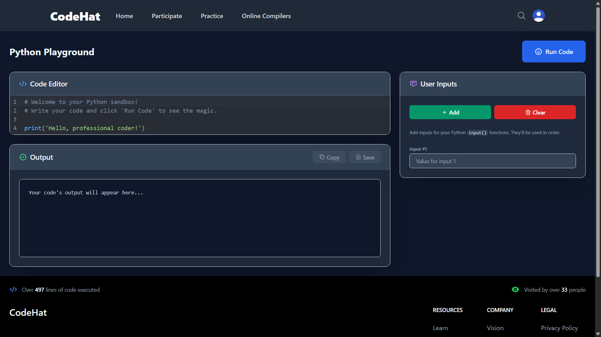

# CodeHat

[](https://opensource.org/licenses/MIT)
[](./CONTRIBUTING.md)
[](https://github.com/the-adee/CodeHat/issues)
[](https://github.com/the-adee/CodeHat/fork)
[](https://github.com/the-adee/CodeHat/stargazers)

> The way you code shapes the way you think. And the platform you choose shapes the coder you become.

CodeHat is a platform designed to provide a seamless and efficient coding environment in your browser. Run code with custom inputs, test algorithms, and experiment with logic without the overhead of a traditional IDE.

This repository contains the official **open-source frontend** for the CodeHat platform.

**Built for Coders, Open to Everyone. No Cost. No Catch. Just Code.**


_This is how CodeHat code editor looks._

---

## ✨ Key Features

- **High-Performance Editor**: A lightweight and optimized code editor built with CodeMirror, designed to be faster and more responsive than many conventional online editors.
- **Custom Input Handling**: Easily provide standard input (`stdin`) to your programs to test various edge cases and scenarios.
- **Multi-Language Support**: Python and Java execution environments with a clear roadmap for more languages.
- **User Authentication**: Firebase-powered authentication with email verification, password reset, and "remember me" sessions.
- **Practice Problems**: Browse and solve coding problems with difficulty ratings and solution availability indicators.
- **Open Source Frontend**: The entire user-facing interface is open source (MIT License), welcoming community contributions and ensuring transparency in its development.

## 🚀 Getting Started

### Prerequisites

- [Node.js](https://nodejs.org/) v18 or higher
- npm v9 or higher
- A Firebase project (for authentication and Firestore)

### Setup

1.  **Clone the repository:**

    ```sh
    git clone https://github.com/the-adee/CodeHat.git
    cd CodeHat/Frontend
    ```

2.  **Install dependencies:**

    ```sh
    npm install
    ```

3.  **Configure environment variables:**

    ```sh
    cp .env.example .env
    ```

    Edit `.env` and fill in your Firebase config values and other required variables. See `.env.example` for documentation on each variable.

4.  **Run the development server:**

    ```sh
    npm run dev
    ```

    The application will be available at `http://localhost:5173`.

### Available Scripts

| Command | Description |
|---|---|
| `npm run dev` | Start development server |
| `npm run build` | Build for production |
| `npm run preview` | Preview production build |
| `npm run lint` | Run ESLint |
| `npm test` | Run tests (Vitest) |
| `npm run test:watch` | Run tests in watch mode |

## 🛠️ Technology Stack

| Category | Technology |
|---|---|
| **Framework** | React 19 |
| **Build Tool** | Vite 7 |
| **Code Editor** | CodeMirror 6 |
| **Styling** | Tailwind CSS 3 |
| **Authentication** | Firebase Auth |
| **Database** | Cloud Firestore |
| **Testing** | Vitest + React Testing Library |
| **Deployment** | Vercel |

## 📁 Project Structure

```
Frontend/src/
├── admin/           # Admin panel components
├── auth/            # Auth guards and route protection
├── components/      # Reusable UI components
│   ├── CodeEditor/  # CodeMirror editor wrappers
│   ├── Layout/      # Shared page layout (Header + Footer)
│   ├── LoadingScreen/
│   ├── Navigation/  # Header and Footer
│   └── UI/          # Generic UI components (Alert, etc.)
├── context/         # React Context providers (AuthContext)
├── errors/          # Error page components
├── hooks/           # Custom React hooks
├── pages/           # Route-level page components
│   ├── Auth/        # Login, Register, Password Reset, etc.
│   └── Coding/      # Compilers, Practice, Problem Solver
├── user-profile/    # User profile management
└── utils/           # Utility functions
```

## 🗺️ Roadmap

- [ ] **Containerized Backend**: Docker-based isolated execution environments for user code.
- [ ] **Multi-Language Support**: Expanding to include JavaScript, C++, and Go.
- [ ] **Code Snippet History**: Allowing users to save and revisit past code sessions.
- [ ] **UI/UX Enhancements**: Continued improvements to the interface and user experience.
- [ ] **Backend Source**: Considering open-sourcing the backend in the future.

## 🤝 How to Contribute

Contributions to the CodeHat frontend are highly welcome! Whether it's a bug fix, a new feature, or a documentation update, your input is valued.

- **Report a Bug:** Find a bug? Please [open an issue](https://github.com/the-adee/CodeHat/issues) with a detailed description.
- **Suggest a Feature:** Have an idea for the UI or a new feature? We'd love to hear it in an [issue](https://github.com/the-adee/CodeHat/issues).
- **Submit a Pull Request:** Please fork the repository and submit a PR for review.

## 📄 License

The code in this repository is licensed under the MIT License. See the [LICENSE](./LICENSE) file for details.
